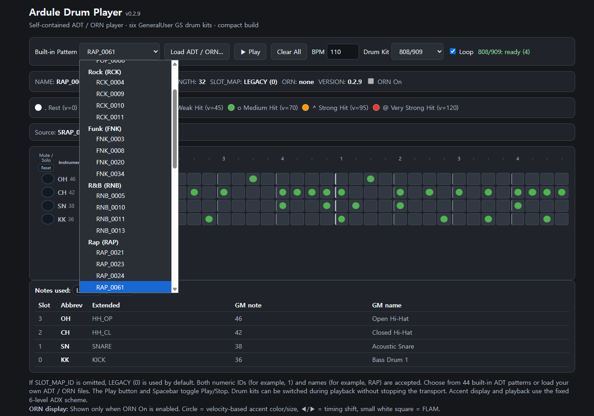

# Ardule Drum Patternology
## An Open Platform for Drum Patternology

**Analyze • Abstract • Exchange • Play**

**Ardule** is an **open cross-platform software ecosystem** for analyzing, abstracting, exchanging, and playing reusable drum patterns derived from Standard MIDI drum performances.

> **Note:** The term **ADX Drum** is still used in various parts of this documentation. To establish a more distinctive identity, it will gradually be replaced by **Ardule Drum Patternology**.

<p align="center">
  
</p>

## Try Ardule

**Curious?**
Download the self-contained **[Ardule Drum Player HTML file](./ardule-drum-player.html)** and open it in your web browser. No installation is required. The player includes 44 embedded drum patterns and six drum kits, so you can start exploring immediately.

**Want more patterns?**
Explore the **[Pattern Collection](./collections/)** and load additional ADT/ORN patterns into the player.

**Want to study drum patterns yourself?**
Explore the **[scripts](./scripts/)** and use the analysis, visualization, and conversion tools to examine Standard MIDI drum performances and create your own ADT/ADP/ORN patterns.

---

## Why Ardule?

The name **Ardule** originated from the combination of **Arduino** and **Module**, reflecting the project's roots in Arduino-based MIDI and sound module development.

The drum pattern system grew out of this hardware-oriented experimentation and eventually led to the **ADT/ADP** family of drum pattern formats.

* **ADT** (*Ardule Drum Text*) is the human-readable drum pattern format.
* **ADP** (*Ardule Drum Pattern*) is the compact binary-cache format generated from ADT for efficient storage and playback.

What began as a lightweight way to represent and play drum patterns gradually expanded into a broader software ecosystem encompassing **MIDI analysis, pattern abstraction, format conversion, visualization, playback, and pattern libraries**.

**Ardule Drum Patternology** brings these tools and formats together as an open platform for studying, transforming, exchanging, and playing drum patterns.

Its core workflow is summarized as:

**Analyze • Abstract • Exchange • Play**

---


## Project Reorganization (v2.3)

With the introduction of the ADT/ADP v2.3 specifications, the project has been reorganized into two independent repositories.

- [Nano Ardule](https://github.com/jeong0449/NanoArdule) remains focused on the hardware and firmware implementation for Arduino Nano- and Raspberry Pi-based embedded MIDI playback.

- **ADX Drum** is a new standalone software project dedicated to Standard MIDI drum analysis, drum pattern abstraction, ADT/ADP/ORN generation, pattern exchange, lightweight playback tools, and the drum pattern library.

This separation clearly distinguishes the embedded playback platform from the software ecosystem, allowing both projects to evolve independently while sharing the same design philosophy.

---

## Platform Overview

```text
                 Standard MIDI Drum Files
                            │
                            ▼
                        Analyze
                            │
          MIDI analysis • PatternLab • Reports
                            │
                            ▼
                        Abstract
                            │
              ADT • ADP • ORN Specifications
                            │
                            ▼
                        Exchange
                            │
            Pattern Library • Portable Formats
                            │
                            ▼
                           Play
                            │
          ADX Drum Player • Nano Ardule • Fluid Ardule
```

The ADX Platform consists of four major components:

- [**ADC Toolkit**](./scripts/README_KO.md) – Tools for MIDI analysis, preprocessing, pattern abstraction, and format conversion.
- **ADT / ADP / ORN** – Open drum pattern specifications for human-readable editing, compact binary playback, and ornament representation.
- **ADX Drum Player** – A lightweight player for validating and performing ADT/ADP/ORN patterns.
- **Pattern Library** – A collection of reusable and exchangeable drum patterns derived from Standard MIDI files.

Together, these components provide a complete workflow from **performance MIDI** to **portable drum patterns**.

---

## Acknowledgements

The reference patterns used in the development of **ADX Drum** are primarily based on collections of Standard MIDI drum files circulated through the music and MIDI community. The particular set used for this project was obtained from the Cakewalk forum:

* [460 Free GM MIDI Drum Patterns](https://discuss.cakewalk.com/topic/648-460-free-gm-midi-drum-patterns/)

The downloadable archive contains three collections of GM drum-pattern MIDI files. Historical references associated with these files suggest that they were originally distributed by **FivePin Press**, although their exact authorship and publication history are not entirely clear.

Two of the collections appear to have a connection with the work of **René-Pierre Bardet**, author of the well-known drum-machine pattern books:

* *200 Drum Machine Patterns*
* *260 Drum Machine Patterns*

Bardet's work belongs to an important period in the history of programmable drum machines and helped establish the idea of drum patterns as reusable musical building blocks. His books continue to circulate today in both printed and digitized forms and remain useful historical references for drum-machine programming.

The MIDI collections obtained through the Cakewalk forum proved especially valuable during the development of ADX Drum. Rather than being treated simply as patterns to reproduce, they served as a substantial real-world dataset for studying rhythmic structure, MIDI timing, subdivision, velocity, repetition, variation, and exceptional cases that do not always fit neatly into a predefined pattern representation.

ADX Drum builds upon this historical material by providing tools to **analyze, abstract, exchange, and play** drum patterns in modern software and embedded systems. The reference collections were a starting point; the ADX format and toolkit are intended to work with drum patterns from any source, including newly authored material and patterns derived from Standard MIDI drum performances.

---

## Source Notes

The historical relationship among the MIDI collections, the publications attributed to **FivePin Press**, and the books of **René-Pierre Bardet** is less straightforward than it initially appears. The following notes therefore distinguish between relationships that could be verified by direct comparison and those that remain uncertain.

The archive obtained through the Cakewalk forum contains three collections of MIDI drum patterns. The files appear to originate from material once distributed by **FivePin Press**. However, an archived description of the FivePin Press material examined during this project does not mention René-Pierre Bardet. It is therefore difficult to establish from that description alone whether the MIDI files were officially derived from Bardet's books, independently transcribed from them, or subsequently associated with them during redistribution.

Direct comparison nevertheless reveals a strong relationship in at least one case. The collection containing **260 patterns** corresponds closely to the patterns in Bardet's *260 Drum Machine Patterns*. Pattern structure and ordering agree sufficiently well that the relationship between the two is readily apparent.

The situation surrounding the **200-pattern collection** is considerably less clear.

A PDF widely circulated online under the title *200 Drum Machine Patterns* and attributed to René-Pierre Bardet was examined during the development of ADX Drum. Although its opening material—including the cover and table of contents—belongs to Bardet's book, most of the PDF is actually replaced by another work: **Ray F. Badness's** *Drum Programming: A Complete Guide to Program and Think Like a Drummer*. The reason for this mixed document is unknown, but copies of it appear to have circulated widely enough to create considerable confusion when attempting to identify the original source.

Badness's book is itself a valuable work on drum programming, but its contents do **not** correspond to the 200-pattern MIDI collection distributed with the FivePin Press material. Consequently, the original printed source of the MIDI files whose names begin with **2** could not be established from the materials examined during this project.

The third collection, **27 Instant Rap Patterns**, presents a similar provenance problem: its original author or compiler could not be reliably identified from the available material.

These observations led to an important practical decision for ADX Drum: the MIDI files are treated as **historical reference datasets**, rather than as authoritative digital editions of particular printed books. Where a relationship can be demonstrated by direct comparison—most notably in the 260-pattern collection—it can be documented as such. Where the provenance remains uncertain, ADX Drum preserves the available source information without making stronger claims about authorship or publication history.

For the same reason, pattern identifiers in the ADX library are assigned independently of the numbering or naming conventions found in the historical MIDI collections. Source filenames, locations, and other available provenance information may instead be retained as metadata, allowing the origin of an analyzed pattern to be traced without implying a bibliographic certainty that the surviving materials do not support.

