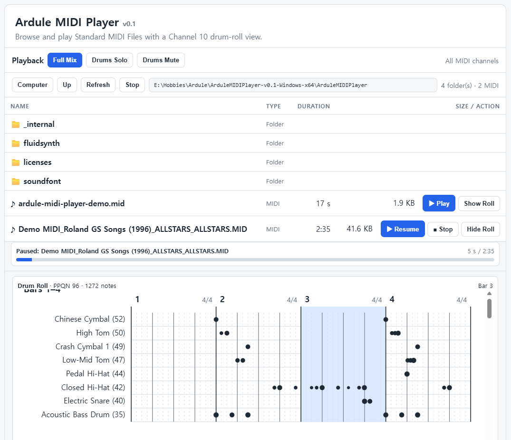
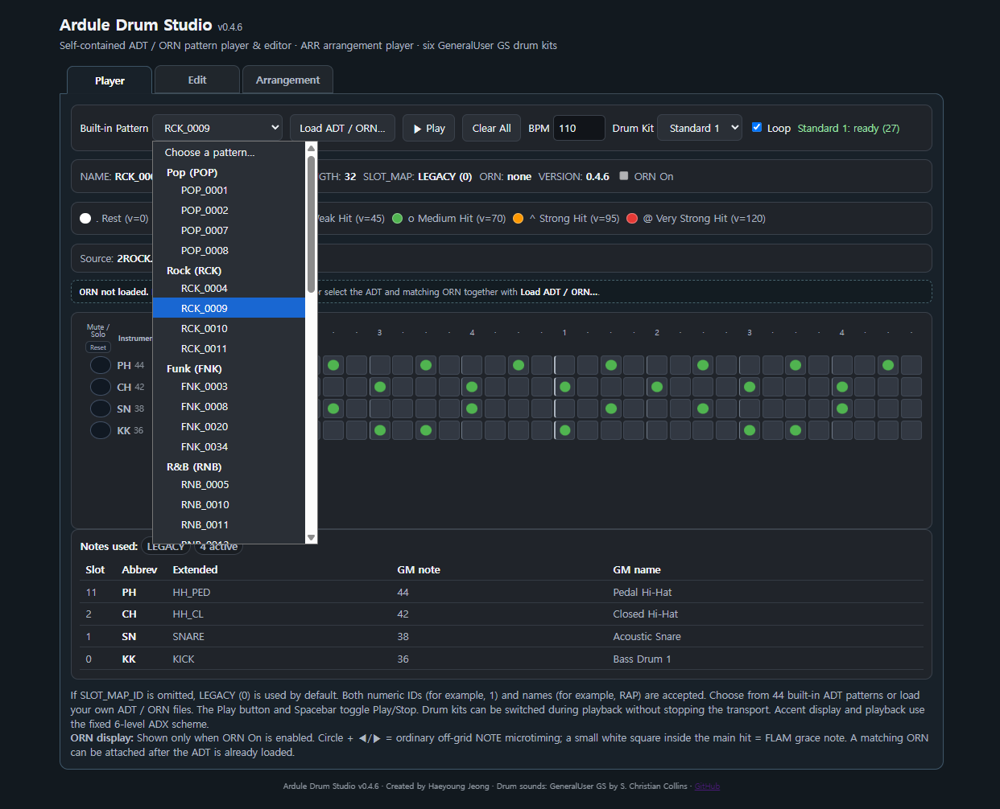

# Ardule Drum Patternology
## An Open Platform for Drum Patternology

**Analyze • Abstract • Exchange • Play**

**Ardule** is an **open cross-platform software ecosystem** for analyzing, abstracting, exchanging, and playing reusable drum patterns derived from Standard MIDI drum performances.

> **Note:** The term **ADX Drum** is still used in various parts of this documentation. To establish a more distinctive identity, it will gradually be replaced by **Ardule Drum Patternology**.

<table>
  <tr>
    <td align="center" width="50%">
      <b>Ardule MIDI Player</b>  
      
    </td>
    <td align="center" width="50%">
      <b>Ardule Drum Studio</b>  
      
    </td>
  </tr>
</table>

  <b>▶ Watch the demo</b>  
  

## Try Ardule

**Want to play MIDI files and inspect their drum roll?**  
Try **[Ardule MIDI Player](./midi-player/)**, a lightweight Standard MIDI File player with a web-based GUI and a dedicated Channel 10 drum-roll view. It supports Full Mix, Drums Solo, and Drums Mute modes. A ready-to-run Windows x64 version, including FluidSynth, a General MIDI compatible SoundFont, and a demo MIDI file, is available from the [ArduleMIDIPlayer-v0.1-Windows-x64.zip
](https://github.com/jeong0449/Ardule/releases/download/midi-player-v0.1/ArduleMIDIPlayer-v0.1-Windows-x64.zip).

**Curious about drum patterns?**  
Download the self-contained [**Ardule Drum Studio HTML file**](./ardule-drum-studio-v0.4.6.html) (~7.8 MB) and open it in your web browser. No installation is required. The Studio includes 44 embedded drum patterns and six drum kits, so you can start exploring immediately. You can also **drag and drop your own ADT/ORN pattern files directly into the Studio** to visualize, edit, and play them. It also runs on mobile devices, although the current interface is primarily designed for desktop screens.

**Want more patterns?**  
Explore the **[Pattern Collection](./collections/)** and drag ADT/ORN pattern files into **Ardule Drum Studio** for visualization, editing, and playback. You can also browse the **PDF pattern books** included in the collection for a convenient visual reference to the available patterns.

**Want to study drum patterns yourself?**  
Explore the **[scripts](./scripts/)** and use the analysis, visualization, and conversion tools to examine Standard MIDI drum performances and **derive ADT/ADP/ORN patterns from existing MIDI data**.

---

## Why Ardule?

The name **Ardule** originated from the combination of **Arduino** and **Module**, reflecting the project's roots in Arduino-based MIDI and sound module development.

The drum pattern system grew out of this hardware-oriented experimentation and eventually led to two complementary Ardule drum pattern formats.

* **Ardule Drum Text** (`.ADT`) is the human-readable format for representing drum patterns.
* **Ardule Drum Pattern** (`.ADP`) is the compact binary-cache format generated from Ardule Drum Text for efficient storage and playback.

The `.ADT` extension is used here specifically for **Ardule Drum Text** files. In music information retrieval and related research, **ADT** is also widely used as an abbreviation for *Automatic Drum Transcription*. To avoid ambiguity, this project generally uses the full name **Ardule Drum Text** when referring to the format, while `.ADT` denotes its file extension.

What began as a lightweight way to represent and play drum patterns gradually expanded into a broader software ecosystem encompassing **MIDI analysis, pattern abstraction, format conversion, visualization, playback, and pattern libraries**.

**Ardule Drum Patternology** brings these tools and formats together as an open platform for studying, transforming, exchanging, and playing drum patterns.

Its core workflow is summarized as:

**Analyze • Abstract • Exchange • Play**

---

## Project Reorganization (v2.3)

With the introduction of the ADT/ADP v2.3 specifications, the project has been reorganized into two independent repositories.

- [Nano Ardule](https://github.com/jeong0449/NanoArdule) remains focused on the hardware and firmware implementation for Arduino Nano-based embedded MIDI/drum playback.

- **Ardule**, developed under the **Ardule Drum Patternology** concept, is a standalone software project dedicated to Standard MIDI drum analysis, drum pattern abstraction, ADT/ADP/ORN generation, pattern exchange, lightweight playback tools, and the drum pattern library.

This separation clearly distinguishes the embedded playback platform from the software ecosystem, allowing both projects to evolve independently while sharing the same design philosophy.

---

## Workflow at a Glance

<pre>
        Standard MIDI Drum Files
                   │
                   ▼
               Analyze
                   │
 MIDI analysis • PatternLab • Reports
                   │
                   ▼
               Abstract
                   │
     ADT • ADP • ORN Specifications
                   │
                   ▼
               Exchange
                   │
   Pattern Library • Portable Formats
                   │
                   ▼
                 Play
                   │
 Ardule Drum Studio • Nano Ardule • Fluid Ardule
</pre>

# Platform Overview

The Ardule Platform consists of five major components:

* [**ADX Toolkit**](./scripts/README_KO.md) – A collection of tools for Standard MIDI drum analysis, preprocessing, pattern abstraction, format conversion, visualization, and validation. It includes PatternLab, MIDI/ADT/ADP/ORN converters, reporting tools, and patternbook generation.
* [**ADT / ADP / ORN Specifications**](./specs/) – Portable drum pattern formats for human-readable representation, compact playback-oriented encoding, and ornament or microtiming information.
* [**Ardule MIDI Player**](./midi-player/) – A self-contained browser-based application for playing Standard MIDI Files with Channel 10 drum-roll visualization, distributed as a ready-to-run Windows package.
* **Ardule Drum Studio (formerly Ardule Drum Player)** – A self-contained HTML application for loading, visualizing, editing, and playing ADT/ADP/ORN drum patterns directly in a web browser.
* [**Pattern Library**](./collections/) – A growing collection of reusable and exchangeable drum patterns derived from Standard MIDI sources and organized for analysis, comparison, playback, and reuse.

>**Python-based ADX Drum Players:** The project also retains **`adx-drum-player.py`** and **`adx-drum-player-win.py`**, Python-based drum pattern players for Linux and Windows, respectively. They provide direct playback of ADT/ADP/ORN patterns from the command line while displaying the drum pattern in a **terminal-based grid view**. They also serve as useful reference and testing implementations of the pattern formats and playback logic.
>
>Unlike the self-contained Ardule Drum Player, these command-line players require **FluidSynth** and an appropriate **SoundFont (SF2)** to be installed or provided separately.

Together, these components provide a workflow from **Standard MIDI performance data** through **analysis and abstraction** to **portable drum patterns, editing, exchange, visualization, and playback**.

---

## Source MIDI Policy

As a general policy, the **Ardule project does not redistribute original MIDI files used as source material**. Source MIDI files are used only for analysis and pattern extraction.

Released collections contain derived drum-pattern representations produced through processes such as segmentation, slot-based abstraction, and, where necessary, data curation. Source and provenance information is documented for each collection whenever available.

---

## Acknowledgements

The reference patterns used in the development of **ADX Drum** are primarily based on collections of Standard MIDI drum files circulated through the music and MIDI community. The particular set used for this project was obtained from the Cakewalk forum:

* [460 Free GM MIDI Drum Patterns](https://discuss.cakewalk.com/topic/648-460-free-gm-midi-drum-patterns/)

The downloadable archive contains three collections of GM drum-pattern MIDI files. Historical references associated with these files suggest that they were originally distributed by **FivePin Press**, although their exact authorship and publication history are not entirely clear.

Two of the collections appear to have a connection with the work of **René-Pierre Bardet**, author of the well-known drum-machine pattern books:

* *200 Drum Machine Patterns*
* *260 Drum Machine Patterns*

Bardet's work belongs to an important period in the history of programmable drum machines and helped establish the idea of drum patterns as reusable musical building blocks. His books continue to circulate today in both printed and digitized forms and remain useful historical references for drum-machine programming.

The MIDI collections obtained through the Cakewalk forum proved especially valuable during the development of ADX Drum. Rather than being treated simply as patterns to reproduce, they served as a substantial real-world dataset for studying rhythmic structure, MIDI timing, subdivision, velocity, repetition, variation, and exceptional cases that do not always fit neatly into a predefined pattern representation.

ADX Drum builds upon this historical material by providing tools to **analyze, abstract, exchange, and play** drum patterns in modern software and embedded systems. The reference collections were a starting point; the ADX format and toolkit are intended to work with drum patterns from any source, including newly authored material and patterns derived from Standard MIDI drum performances.

---

## Source Notes

The historical relationship among the MIDI collections, the publications attributed to **FivePin Press**, and the books of **René-Pierre Bardet** is less straightforward than it initially appears. The following notes therefore distinguish between relationships that could be verified by direct comparison and those that remain uncertain.

The archive obtained through the Cakewalk forum contains three collections of MIDI drum patterns. The files appear to originate from material once distributed by **FivePin Press**. However, an archived description of the FivePin Press material examined during this project does not mention René-Pierre Bardet. It is therefore difficult to establish from that description alone whether the MIDI files were officially derived from Bardet's books, independently transcribed from them, or subsequently associated with them during redistribution.

Direct comparison nevertheless reveals a strong relationship in at least one case. The collection containing **260 patterns** corresponds closely to the patterns in Bardet's *260 Drum Machine Patterns*. Pattern structure and ordering agree sufficiently well that the relationship between the two is readily apparent.

The situation surrounding the **200-pattern collection** is considerably less clear.

A PDF widely circulated online under the title *200 Drum Machine Patterns* and attributed to René-Pierre Bardet was examined during the development of ADX Drum. Although its opening material—including the cover and table of contents—belongs to Bardet's book, most of the PDF is actually replaced by another work: **Ray F. Badness's** *Drum Programming: A Complete Guide to Program and Think Like a Drummer*. The reason for this mixed document is unknown, but copies of it appear to have circulated widely enough to create considerable confusion when attempting to identify the original source.

Badness's book is itself a valuable work on drum programming, but its contents do **not** correspond to the 200-pattern MIDI collection distributed with the FivePin Press material. Consequently, the original printed source of the MIDI files whose names begin with **2** could not be established from the materials examined during this project.

The third collection, **27 Instant Rap Patterns**, presents a similar provenance problem: its original author or compiler could not be reliably identified from the available material.

These observations led to an important practical decision for ADX Drum: the MIDI files are treated as **historical reference datasets**, rather than as authoritative digital editions of particular printed books. Where a relationship can be demonstrated by direct comparison—most notably in the 260-pattern collection—it can be documented as such. Where the provenance remains uncertain, ADX Drum preserves the available source information without making stronger claims about authorship or publication history.

For the same reason, pattern identifiers in the ADX library are assigned independently of the numbering or naming conventions found in the historical MIDI collections. Source filenames, locations, and other available provenance information may instead be retained as metadata, allowing the origin of an analyzed pattern to be traced without implying a bibliographic certainty that the surviving materials do not support.

