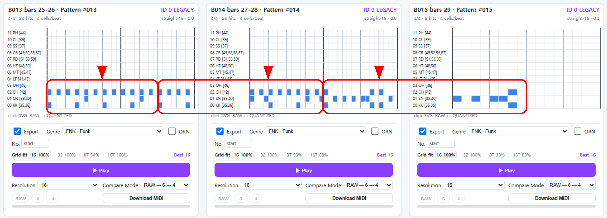

# Analysis Note: 2FUNK3.MID

## 3-Beat Interpretation of the Final Section

**Source MIDI:** `2FUNK3.MID`  
**Region:** bars 25–29  
**Nominal time signature:** 4/4  
**Export status:** Not exported to ADT/ADP

### Observation

`2FUNK3.MID` is nominally a 4/4 MIDI file, and no time-signature change is
specified before or within its final section.

However, inspection of bars 25–29 suggests that the musical structure of
this region is better interpreted as a sequence of **three 3-beat patterns**
rather than as conventional 4/4 measures.

The figure above shows the final five nominal 4/4 bars as displayed by
PatternLab. The red boxes indicate the proposed 3-beat pattern units, while
the inverted triangles indicate their internal measure boundaries.

Under this interpretation, the region can be reorganized as:

- Pattern 1: 3 beats + 3 beats
- Pattern 2: 3 beats + 3 beats
- Pattern 3: 3 beats + 3 beats

Each pattern therefore consists of a **3-beat measure repeated twice**.

In total, the section contains **18 beats**, corresponding exactly to six
3-beat measures, or three two-measure patterns.

### Interpretation

Although the MIDI file formally remains in 4/4, the rhythmic organization
of this section strongly suggests an implicit **3-beat grouping**.

This is an example where the musical structure inferred from note placement
does not agree with the measure boundaries implied by the MIDI time-signature
metadata.

For ADX pattern analysis, preserving the apparent rhythmic organization is
more meaningful than mechanically dividing the material according to the
nominal 4/4 bar boundaries.

### ADX Export Decision

This section was **not exported to ADT/ADP**.

The source MIDI contains no explicit time-signature change, and converting
the passage into 3-beat ADX patterns would therefore require an interpretive
re-segmentation of the source rather than a straightforward extraction.

To avoid introducing an undocumented structural assumption into the pattern
collection, the section was retained only as an analysis case.

### Significance

This case illustrates an important distinction in the ADX workflow:

> MIDI measure boundaries are source metadata, whereas pattern boundaries
> may need to be inferred from the musical content.

PatternLab makes such discrepancies visible and allows exceptional cases to
be documented rather than forcing them into the normal export pipeline.
